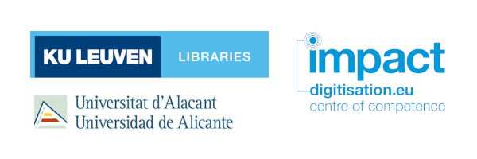
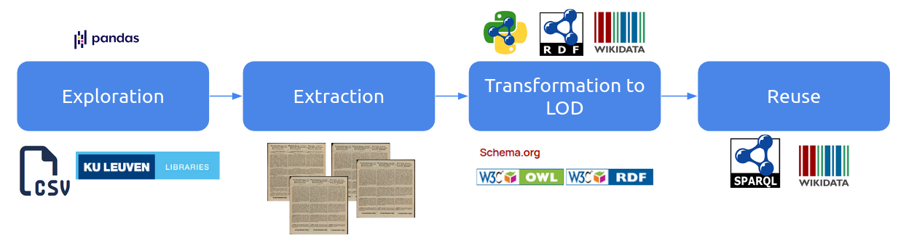
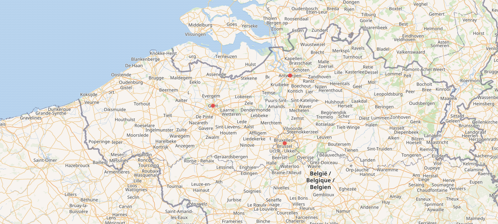

# KU-Leuven-Libraries-Impact-CollectionsAsData

This Jupyter notebook collection is the result of the collaboration between KU Leuven and the [University of Alicante](https://www.ua.es/), as part of the [Impact Centre of Competence in digitisation](https://www.digitisation.eu/).



## Authors

- [Gustavo Candela](https://orcid.org/0000-0001-6122-0777), University of Alicante
- [Nele Gabriëls](https://orcid.org/0000-0002-0325-3228), KU Leuven

## Suggested citation

- Candela, G., & Gabriels, N. (2025). hibernator11/KU-Leuven-Libraries-Impact-CollectionsAsData: First version (1.0). Zenodo. https://doi.org/10.5281/zenodo.15337181

## Datasets
The following datasets published and maintained by [KU Leuven Libraries](https://bib.kuleuven.be/english) will be used in this workshop:

- The digital collection [Wartime posters](https://kuleuven.limo.libis.be/discovery/collectionDiscovery?vid=32KUL_KUL:KULeuven&collectionId=81411182030001488&lang=en) includes proclamations issued by the German General Government in Belgium during the World War I.
- The digital collection [Postcards](https://kuleuven.limo.libis.be/discovery/collectionDiscovery?vid=32KUL_KUL:KULeuven&collectionId=81531489730001488&lang=en) provides a large collection of old Belgian postcards showing, amongst others, village views and a wide range of events. 

## Framework

The following subsections describe the framework applied to reuse the digital collections provided by KU Leuven.



**Exploration**
These examples provide an introduction to pandas and its application to two digital collections: Wartime posters and postcards.

- [Data analysis with pandas](https://nbviewer.org/github/hibernator11/KU-Leuven-Libraries-Impact-CollectionsAsData/blob/main/notebooks/exploration/pandas-introduction.ipynb)
- [Exploring Wartime posters](https://nbviewer.org/github/hibernator11/KU-Leuven-Libraries-Impact-CollectionsAsData/blob/main/notebooks/exploration/wartime-posters-exploration.ipynb)
- [Exploring postcards](https://nbviewer.org/github/hibernator11/KU-Leuven-Libraries-Impact-CollectionsAsData/blob/main/notebooks/exploration/postcards-exploration.ipynb)

**Extraction** This example shows how to extract and download the posters
- [Downloading Wartime posters](https://nbviewer.org/github/hibernator11/KU-Leuven-Libraries-Impact-CollectionsAsData/blob/main/notebooks/extraction/wartime-posters-extraction.ipynb) This example shows how to download the posters as images

**Transformation and enrichment**
- [Transformation to LOD - Wartime posters](https://nbviewer.org/github/hibernator11/KU-Leuven-Libraries-Impact-CollectionsAsData/blob/main/notebooks/transformation/wartime-posters-transformation-LOD.ipynb) This example shows how to transform the Wartime posters provided as a CSV file to Linked Open Data 
- [Transformation - refinement - postcards](https://nbviewer.org/github/hibernator11/KU-Leuven-Libraries-Impact-CollectionsAsData/blob/main/notebooks/transformation/postcards-transformation-refinement.ipynb) Imagine we want to extract the location included in the uniform title. This example shows how to extract and load data from existing colums and datasets.

**Reuse**
- [Reuse - Wartime posters](https://nbviewer.org/github/hibernator11/KU-Leuven-Libraries-Impact-CollectionsAsData/blob/main/notebooks/transformation/wartime-posters-reuse.ipynb) This example shows how to use SPARQL to analyse the data generated

- Thanks to the enrichment with external repositories such as Wikidata, we can create mpa visualisations using the [Wikidata SPARQL endpoint](https://w.wiki/Dyey):

```
#defaultView:Map
select *
WHERE { 
    VALUES ?place {wd:Q1296 wd:Q111901161 wd:Q12892 }
    ?place wdt:P625 ?coord .
    SERVICE wikibase:label { bd:serviceParam wikibase:language "[AUTO_LANGUAGE],en". }
}
```



## Running the notebooks
**To execute the notebook in Binder:**

[](https://mybinder.org/v2/gh/hibernator11/KU-Leuven-Libraries-Impact-CollectionsAsData/HEAD)

- Click the launch binder button above. Once the demo launches, click My_sample_notebook.ipynb in the file listing.
- Run the notebook by selecting Cell > Run All. You call also click the play button to run the notebook cell by cell. You will the output of each cell.
- You can edit the cells, and click on play to run and see the changes.

## Licence
<a rel="license" href="http://creativecommons.org/licenses/by/4.0/"></a><br />Content is licensed under a <a rel="license" href="http://creativecommons.org/licenses/by/4.0/">Creative Commons Attribution 4.0 International license</a>.

Please, note that the datasets used in this project have separate licences.

## Task

Once you have run the examples provided in this project, follow these steps:

- Create a Jupyter notebook from scracth. You can copy one of the examples provided and update it.
- You have seen how to transform the Wartime posters to LOD. Could you adapt the Wartime posters code to transform the postcards to LOD? You can copy and adapt the code provided.
- What things could be improved? 

## References

- Candela, G., Holownia, O., Odsbjerg, M., Cuper, M., Gabriëls, N., Hofmann, K., Gray, E.J., Chambers, S. and Mahey, M. (2025) ‘Promoting Computational Access to Digital Collections in the Nordic and Baltic Countries: An Icelandic Use Case’, Journal of Open Humanities Data, 11(1), p. 7. Available at: https://doi.org/10.5334/johd.261.
- Candela, G., Cuper, M., Holownia, O., Gabriëls, N., Dobreva, M., Mahey, M. (2024). A Systematic Review of Wikidata in GLAM Institutions: a Labs Approach. In: Antonacopoulos, A., et al. Linking Theory and Practice of Digital Libraries. TPDL 2024. Lecture Notes in Computer Science, vol 15178. Springer, Cham. https://doi.org/10.1007/978-3-031-72440-4_4
- Candela, G., Chambers, S., Irollo, A., Freire, N., Dritsou, V., Isaac, A., Benardou, A., Garnett, V., & Tasovac, T. (2025). A Workflow to publish Collections as Data: looking back at Europeana.eu and forward to the common European data space for cultural heritage (Versión v2). Zenodo. https://doi.org/10.5281/zenodo.15275024
- Mahey, M., Candela, G., Holownia, O., Gabriels, N., & Chambers, S. (2025). GLAM Labs Annual Report 2024 (Final Version). Zenodo. https://doi.org/10.5281/zenodo.15096604
